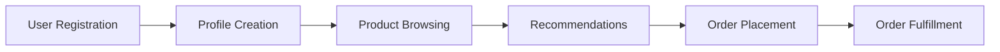
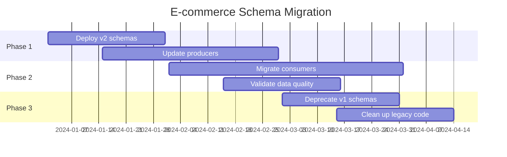

# E-commerce Platform Schemas

🛒 **Realistic schemas for a growing online retailer expanding globally**

This directory contains Avro schemas for a modern e-commerce platform, demonstrating real-world data modeling patterns, internationalization considerations, and schema evolution strategies.

## 📁 Schema Categories

### [User Profile](user-profile/)
**Business Context**: Customer data management with GDPR compliance

- **v1**: Basic customer information
- **v2**: Added GDPR compliance fields, consent tracking, and enhanced privacy controls

**Key Features**:
- GDPR-compliant data structure
- Consent management tracking
- Privacy preference controls
- Multi-language support

### [Order Events](order-events/)
**Business Context**: Order lifecycle management and payment integration

- **v1**: Complete order event tracking with payment states

**Key Features**:
- Comprehensive order lifecycle
- Payment method flexibility
- Shipping and billing address handling
- Order item details with variants

### [Product Catalog](product-catalog/)
**Business Context**: Product information management with internationalization

- **v1**: Basic product catalog structure
- **v2**: Enhanced with internationalization, regional pricing, and SEO optimization

**Key Features**:
- Multi-currency pricing
- Localized product information
- SEO optimization fields
- Inventory management integration
- Product attribute flexibility

### [Recommendation](recommendation/)
**Business Context**: ML-driven personalization and recommendation engine

- **v1**: Basic recommendation structure
- **v2**: Advanced ML features with A/B testing and personalization

**Key Features**:
- Multiple recommendation algorithms
- A/B testing integration
- Personalization factors
- Quality metrics tracking
- Performance predictions

## 🔄 Evolution Patterns Demonstrated

### GDPR Compliance Evolution
**User Profile v1 → v2**

```json
// Added in v2 for GDPR compliance
{
  "name": "privacy_settings",
  "type": {
    "type": "record",
    "name": "PrivacySettings",
    "fields": [
      {
        "name": "data_processing_consent",
        "type": "boolean",
        "default": false
      },
      {
        "name": "marketing_consent",
        "type": "boolean", 
        "default": false
      },
      {
        "name": "consent_timestamp",
        "type": {
          "type": "long",
          "logicalType": "timestamp-millis"
        }
      }
    ]
  },
  "default": {
    "data_processing_consent": false,
    "marketing_consent": false,
    "consent_timestamp": 0
  }
}
```

### Internationalization Evolution
**Product Catalog v1 → v2**

```json
// Added in v2 for global expansion
{
  "name": "localized_names",
  "type": {
    "type": "map",
    "values": "string"
  },
  "default": {},
  "doc": "Localized product names by language code"
},
{
  "name": "regional_prices",
  "type": {
    "type": "map",
    "values": {
      "type": "record",
      "name": "RegionalPrice",
      "fields": [...]
    }
  },
  "default": {},
  "doc": "Regional pricing by country/region code"
}
```

### ML Enhancement Evolution
**Recommendation v1 → v2**

```json
// Added in v2 for advanced ML
{
  "name": "experiment_config",
  "type": {
    "type": "record",
    "name": "ExperimentConfig",
    "fields": [
      {
        "name": "experiment_id",
        "type": ["null", "string"],
        "default": null
      },
      {
        "name": "variant",
        "type": ["null", "string"], 
        "default": null
      }
    ]
  },
  "default": {"experiment_id": null, "variant": null}
}
```

## 🎯 Business Use Cases

### Customer Journey Tracking


**Schemas Involved**:
- User Profile → Customer data
- Product Catalog → Browse inventory
- Recommendation → Personalized suggestions
- Order Events → Purchase tracking

### Global Expansion Scenario
```yaml
Scenario: Expanding to EU market
Requirements:
  - GDPR compliance
  - Multi-currency support
  - Localized content
  - Regional pricing

Schemas Updated:
  - User Profile: Added privacy controls
  - Product Catalog: Added internationalization
  - Order Events: Enhanced currency handling
```

### Personalization Engine
```yaml
Scenario: Implementing ML-driven recommendations
Components:
  - User behavior tracking
  - Product affinity modeling
  - A/B testing framework
  - Real-time personalization

Schemas Involved:
  - User Profile: Behavioral data
  - Product Catalog: Product attributes
  - Recommendation: ML outputs
```

## 🔧 Integration Examples

### Customer Onboarding Flow
```python
# Example data flow
def customer_onboarding(user_data):
    # 1. Create user profile
    profile = UserProfile(
        id=generate_user_id(),
        email=user_data['email'],
        name=user_data['name'],
        privacy_settings={
            'data_processing_consent': user_data['gdpr_consent'],
            'marketing_consent': user_data['marketing_opt_in'],
            'consent_timestamp': current_timestamp()
        }
    )
    
    # 2. Initialize recommendation engine
    recommendation_context = create_recommendation_context(
        user_id=profile.id,
        user_segment='new_customer',
        onboarding_flow=True
    )
    
    return profile, recommendation_context
```

### Order Processing Pipeline
```python
# Example order event processing
def process_order_event(order_event):
    # Update inventory
    for item in order_event.items:
        update_product_inventory(
            product_id=item.product_id,
            quantity_change=-item.quantity
        )
    
    # Update user profile
    update_user_purchase_history(
        user_id=order_event.customer_id,
        order_value=order_event.total_amount,
        products=order_event.items
    )
    
    # Trigger recommendations update
    update_recommendation_model(
        user_id=order_event.customer_id,
        purchased_products=order_event.items
    )
```

## 📊 Analytics and Reporting

### Key Metrics Tracked

**User Metrics**:
- Customer acquisition rate
- GDPR consent rates
- Profile completion rates
- Geographic distribution

**Product Metrics**:
- Catalog coverage by region
- Price localization effectiveness
- Inventory turnover
- SEO performance

**Recommendation Metrics**:
- Click-through rates
- Conversion rates
- Recommendation diversity
- A/B test performance

**Order Metrics**:
- Order conversion funnel
- Payment method adoption
- Regional performance
- Customer lifetime value

### Sample Analytics Queries

```sql
-- Customer acquisition by region
SELECT 
    country_code,
    COUNT(*) as new_customers,
    AVG(first_order_value) as avg_first_order
FROM user_profiles 
WHERE created_at >= date_trunc('month', current_date)
GROUP BY country_code;

-- Recommendation effectiveness
SELECT 
    algorithm,
    AVG(click_through_rate) as avg_ctr,
    AVG(conversion_rate) as avg_conversion
FROM recommendations 
WHERE created_at >= current_date - interval '30 days'
GROUP BY algorithm;

-- Product performance by region
SELECT 
    p.category,
    o.region,
    SUM(oi.quantity) as units_sold,
    SUM(oi.unit_price * oi.quantity) as revenue
FROM products p
JOIN order_items oi ON p.id = oi.product_id
JOIN orders o ON oi.order_id = o.id
GROUP BY p.category, o.region;
```

## 🛡️ Privacy and Compliance

### GDPR Implementation

**Data Subject Rights**:
- Right to access (user profile export)
- Right to rectification (profile updates)
- Right to erasure (account deletion)
- Right to portability (data export)

**Consent Management**:
```json
{
  "privacy_settings": {
    "data_processing_consent": true,
    "marketing_consent": false,
    "analytics_consent": true,
    "consent_timestamp": 1609459200000,
    "consent_version": "2.1"
  }
}
```

**Data Retention**:
- User profiles: Retained while account active
- Order history: 7 years for tax purposes
- Recommendations: 30 days for optimization
- Analytics data: Anonymized after 2 years

## 🚀 Deployment Strategies

### Schema Registry Configuration
```yaml
subjects:
  - name: "ecommerce.user-profile"
    compatibility: BACKWARD
    versions: [v1, v2]
    
  - name: "ecommerce.product-catalog"
    compatibility: BACKWARD  
    versions: [v1, v2]
    
  - name: "ecommerce.order-events"
    compatibility: FORWARD
    versions: [v1]
    
  - name: "ecommerce.recommendations"
    compatibility: FULL
    versions: [v1, v2]
```

### Migration Timeline


## 🔗 Related Resources

- [Schema Evolution Examples](../evolution-examples/)
- [IoT Platform Schemas](../iot-platform/) - For device tracking
- [Fintech Schemas](../fintech/) - For payment processing
- [SaaS Platform Schemas](../saas-platform/) - For analytics

---

**Next Steps**: 
1. Review individual schema files for detailed field documentation
2. Test schema compatibility using the MCP server
3. Adapt schemas for your specific e-commerce requirements
4. Implement proper data governance and privacy controls
