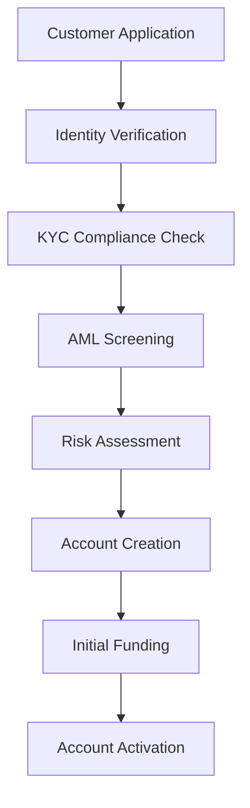

# Financial Services Schemas

💰 **Digital bank with comprehensive regulatory compliance and risk management**

This directory contains Avro schemas for a modern digital banking platform, demonstrating financial data modeling, regulatory compliance, fraud detection, and risk assessment patterns required in the financial services industry.

## 📁 Schema Categories

### [Transactions](transactions/)
**Business Context**: Payment processing with comprehensive audit trails

- **v1**: Core transaction processing with payment method flexibility and regulatory compliance

**Key Features**:
- Multi-payment method support (card, bank transfer, digital wallet)
- Comprehensive transaction lifecycle tracking
- Regulatory compliance fields (AML, KYC)
- Real-time fraud detection integration
- International transfer support
- Audit trail maintenance

### [Accounts](accounts/)
**Business Context**: Customer account management with multi-currency support

- **v1**: Basic account structure with balance tracking
- **v2**: Enhanced with compliance status, multi-currency support, and regulatory reporting

**Key Features**:
- Multi-currency account support
- KYC/AML compliance tracking
- Overdraft protection management
- Terms and conditions versioning
- Regulatory reporting (FATCA, CRS)
- Account status lifecycle management

### [Compliance](compliance/)
**Business Context**: Regulatory compliance and audit data management

- **v1**: Comprehensive compliance event tracking for regulatory requirements

**Key Features**:
- KYC verification tracking
- AML screening results
- Sanctions list monitoring
- Suspicious activity reporting (SAR)
- Document management
- Regulatory reporting workflows
- Compliance officer review tracking

### [Risk Assessment](risk-assessment/)
**Business Context**: Fraud detection and risk scoring for transactions and customers

- **v1**: Advanced fraud detection and risk analysis system

**Key Features**:
- Real-time fraud scoring
- Device fingerprinting
- Behavioral analysis
- ML model integration
- Location-based risk assessment
- Transaction velocity monitoring
- Risk decision automation

## 🔄 Evolution Patterns Demonstrated

### Regulatory Enhancement
**Accounts v1 → v2**

```json
// Added in v2 for enhanced compliance
{
  "name": "compliance_status",
  "type": {
    "type": "record",
    "name": "ComplianceStatus",
    "fields": [
      {
        "name": "kyc_status",
        "type": {
          "type": "enum",
          "name": "KYCStatus",
          "symbols": ["PENDING", "VERIFIED", "FAILED", "EXPIRED", "UNDER_REVIEW"]
        }
      },
      {
        "name": "aml_risk_level",
        "type": {
          "type": "enum",
          "name": "AMLRiskLevel", 
          "symbols": ["LOW", "MEDIUM", "HIGH", "PROHIBITED"]
        },
        "default": "LOW"
      },
      {
        "name": "sanctions_check",
        "type": {
          "type": "enum",
          "name": "SanctionsStatus",
          "symbols": ["CLEAR", "MATCH", "PENDING", "WHITELIST"]
        },
        "default": "CLEAR"
      }
    ]
  }
}
```

### Multi-Currency Support
**Accounts v1 → v2**

```json
// Added in v2 for global banking
{
  "name": "multi_currency_balances",
  "type": {
    "type": "map",
    "values": {
      "type": "record",
      "name": "CurrencyBalance",
      "fields": [
        {
          "name": "available",
          "type": {
            "type": "bytes",
            "logicalType": "decimal",
            "precision": 15,
            "scale": 2
          }
        },
        {
          "name": "pending",
          "type": {
            "type": "bytes",
            "logicalType": "decimal",
            "precision": 15,
            "scale": 2
          }
        }
      ]
    }
  },
  "default": {},
  "doc": "Balances in different currencies (currency code -> balance)"
}
```

## 🎯 Financial Services Use Cases

### Digital Onboarding Process


**Data Flow**:
1. **Compliance Events** → KYC/AML verification
2. **Risk Assessment** → Customer risk profiling
3. **Accounts** → Account creation and setup
4. **Transactions** → Initial deposit processing

### Real-time Fraud Detection
```yaml
Scenario: Transaction fraud prevention
Components:
  - Device fingerprinting
  - Behavioral analysis
  - Velocity checking
  - Location verification
  - ML-based scoring

Data Sources:
  - Transaction history
  - Device information
  - Location data
  - User behavioral patterns
  - External fraud databases

Decision Engine:
  - Real-time scoring
  - Risk threshold evaluation
  - Automatic blocking/approval
  - Manual review flagging
```

### Regulatory Reporting
```yaml
Scenario: Automated compliance reporting
Regulations:
  - Anti-Money Laundering (AML)
  - Know Your Customer (KYC)
  - Bank Secrecy Act (BSA)
  - FATCA reporting
  - Common Reporting Standard (CRS)

Reporting Requirements:
  - Suspicious Activity Reports (SAR)
  - Currency Transaction Reports (CTR)
  - Cross-border transaction monitoring
  - Customer due diligence updates

Automated Workflows:
  - Threshold monitoring
  - Pattern detection
  - Report generation
  - Regulatory submission
```

## 🔧 Technical Implementation

### Transaction Processing Pipeline
```python
# Example transaction processing with fraud detection
class TransactionProcessor:
    def process_transaction(self, transaction):
        # 1. Validate transaction data
        if not self.validate_transaction(transaction):
            return self.reject_transaction(transaction, "Invalid data")
        
        # 2. Perform risk assessment
        risk_assessment = self.risk_engine.assess_transaction(
            transaction=transaction,
            customer_id=transaction.customer_id,
            account_id=transaction.source_account_id
        )
        
        # 3. Apply risk decision
        if risk_assessment.decision == 'BLOCK':
            return self.block_transaction(transaction, risk_assessment)
        elif risk_assessment.decision == 'REVIEW':
            return self.flag_for_review(transaction, risk_assessment)
        
        # 4. Process approved transaction
        return self.execute_transaction(transaction)

    def execute_transaction(self, transaction):
        # Update account balances
        self.update_account_balance(
            transaction.source_account_id,
            -transaction.amount
        )
        
        if transaction.destination_account_id:
            self.update_account_balance(
                transaction.destination_account_id,
                transaction.amount
            )
        
        # Create compliance events
        if transaction.amount > self.ctr_threshold:
            self.create_compliance_event(
                event_type='CTR_REQUIRED',
                transaction_id=transaction.id
            )
        
        # Update transaction status
        transaction.status = 'COMPLETED'
        transaction.completed_at = current_timestamp()
        
        return transaction
```

### Risk Assessment Engine
```python
# Example risk assessment implementation
class RiskAssessmentEngine:
    def assess_transaction(self, transaction, customer_id, account_id):
        assessment = RiskAssessment(
            assessment_id=generate_id(),
            customer_id=customer_id,
            transaction_id=transaction.id,
            assessment_type='TRANSACTION_SCREENING'
        )
        
        # Device analysis
        device_analysis = self.analyze_device(
            transaction.device_fingerprint,
            customer_id
        )
        assessment.device_analysis = device_analysis
        
        # Location analysis
        location_analysis = self.analyze_location(
            transaction.ip_address,
            customer_id
        )
        assessment.location_analysis = location_analysis
        
        # Behavioral analysis
        behavioral_analysis = self.analyze_behavior(
            transaction,
            customer_id
        )
        assessment.behavioral_analysis = behavioral_analysis
        
        # ML model scoring
        model_results = self.run_ml_models(
            transaction,
            device_analysis,
            location_analysis,
            behavioral_analysis
        )
        assessment.model_results = model_results
        
        # Calculate overall risk score
        assessment.overall_risk_score = self.calculate_risk_score(
            device_analysis.device_trust_score,
            location_analysis.location_risk_score,
            model_results
        )
        
        # Make decision
        assessment.decision = self.make_risk_decision(
            assessment.overall_risk_score
        )
        
        return assessment

    def analyze_behavior(self, transaction, customer_id):
        # Get recent transaction history
        recent_transactions = self.get_recent_transactions(
            customer_id,
            hours=24
        )
        
        # Calculate velocity metrics
        velocity = TransactionVelocity(
            count_last_hour=len([t for t in recent_transactions 
                               if t.timestamp > now() - timedelta(hours=1)]),
            count_last_day=len(recent_transactions),
            amount_last_hour=sum([t.amount for t in recent_transactions 
                                if t.timestamp > now() - timedelta(hours=1)]),
            amount_last_day=sum([t.amount for t in recent_transactions])
        )
        
        # Detect unusual patterns
        unusual_patterns = self.detect_unusual_patterns(
            transaction,
            recent_transactions
        )
        
        return BehavioralAnalysis(
            transaction_velocity=velocity,
            unusual_patterns=unusual_patterns
        )
```

### Compliance Monitoring System
```python
# Example compliance monitoring
class ComplianceMonitor:
    def monitor_transaction(self, transaction):
        compliance_events = []
        
        # Check for CTR requirements
        if transaction.amount >= 10000:  # USD threshold
            compliance_events.append(
                self.create_ctr_event(transaction)
            )
        
        # Check for SAR requirements
        if self.is_suspicious_activity(transaction):
            compliance_events.append(
                self.create_sar_event(transaction)
            )
        
        # Sanctions screening
        sanctions_result = self.screen_against_sanctions(
            transaction.customer_id,
            transaction.counterparty_name
        )
        
        if sanctions_result.match_status != 'NO_MATCH':
            compliance_events.append(
                self.create_sanctions_event(transaction, sanctions_result)
            )
        
        return compliance_events

    def create_sar_event(self, transaction):
        return ComplianceEvent(
            event_id=generate_id(),
            customer_id=transaction.customer_id,
            transaction_id=transaction.id,
            event_type='SUSPICIOUS_ACTIVITY',
            severity='HIGH',
            status='PENDING',
            regulatory_framework='BSA',
            details=ComplianceDetails(
                description='Suspicious transaction pattern detected',
                source_system='fraud_detection',
                detection_method='AUTOMATED'
            ),
            reporting_requirements=ReportingRequirements(
                requires_sar=True,
                deadline=current_timestamp() + timedelta(days=30)
            )
        )
```

## 📊 Risk and Compliance Analytics

### Key Risk Indicators (KRIs)

**Transaction Risk Metrics**:
- Fraud rate by transaction type
- False positive rate optimization
- Risk model performance
- Transaction approval rates
- Geographic risk distribution

**Compliance Metrics**:
- KYC completion rates
- AML alert volume and resolution
- Sanctions screening effectiveness
- SAR filing rates
- Regulatory reporting timeliness

**Customer Risk Metrics**:
- Customer risk score distribution
- High-risk customer identification
- Account closure rates
- Due diligence refresh rates

### Sample Analytics Queries

```sql
-- Fraud detection performance
SELECT 
    DATE(created_at) as date,
    decision,
    COUNT(*) as assessments,
    AVG(overall_risk_score) as avg_risk_score,
    AVG(processing_time_ms) as avg_processing_time
FROM risk_assessments 
WHERE created_at >= current_date - interval '30 days'
GROUP BY DATE(created_at), decision;

-- Compliance alert analysis
SELECT 
    regulatory_framework,
    event_type,
    severity,
    COUNT(*) as event_count,
    AVG(EXTRACT(EPOCH FROM (resolved_at - created_at))/3600) as avg_resolution_hours
FROM compliance_events 
WHERE created_at >= current_date - interval '90 days'
  AND status = 'RESOLVED'
GROUP BY regulatory_framework, event_type, severity;

-- Customer risk distribution
SELECT 
    aml_risk_level,
    kyc_status,
    COUNT(*) as customer_count,
    AVG(CASE WHEN status = 'ACTIVE' THEN 1 ELSE 0 END) as active_rate
FROM accounts
GROUP BY aml_risk_level, kyc_status;

-- Transaction patterns by risk level
SELECT 
    risk_level,
    payment_method,
    COUNT(*) as transaction_count,
    AVG(amount) as avg_amount,
    SUM(amount) as total_amount
FROM transactions t
JOIN risk_assessments r ON t.id = r.transaction_id
WHERE t.created_at >= current_date - interval '7 days'
GROUP BY risk_level, payment_method;
```

## 🔒 Security and Privacy

### Data Protection

**Encryption**:
- End-to-end encryption for sensitive data
- Field-level encryption for PII
- Key rotation and management
- Hardware security modules (HSM)

**Access Controls**:
- Role-based access control (RBAC)
- Principle of least privilege
- Multi-factor authentication
- Audit logging for all access

**Data Minimization**:
```json
{
  "data_retention": {
    "transactions": "7_years",
    "compliance_events": "10_years",
    "risk_assessments": "5_years",
    "pii_data": "customer_lifecycle_plus_7_years"
  },
  "anonymization": {
    "customer_analytics": "after_2_years",
    "transaction_patterns": "immediate",
    "risk_modeling": "after_1_year"
  }
}
```

### Regulatory Compliance

**Financial Regulations**:
- Payment Card Industry (PCI DSS)
- General Data Protection Regulation (GDPR)
- California Consumer Privacy Act (CCPA)
- Basel III capital requirements
- Dodd-Frank Act compliance

**Audit Requirements**:
- SOX compliance for public companies
- Independent security assessments
- Penetration testing
- Compliance monitoring
- Regular risk assessments

## 🚀 Scalability and Performance

### High-Availability Architecture

**Database Sharding**:
- By customer ID
- By geographic region
- By account type
- By transaction date

**Caching Strategy**:
```yaml
caching_layers:
  L1_application:
    - Customer profiles
    - Account balances
    - Risk rules
    - Compliance policies
    
  L2_distributed:
    - Transaction history
    - Risk scores
    - Device fingerprints
    - Location data
    
  L3_persistent:
    - ML model results
    - Compliance reports
    - Analytics aggregates
```

### Real-time Processing

**Stream Processing**:
- Real-time fraud detection
- Transaction monitoring
- Risk score updates
- Compliance alerting

**Batch Processing**:
- Regulatory reporting
- ML model training
- Risk model backtesting
- Customer analytics

## 🔗 Integration Ecosystem

### External Integrations

**Payment Networks**:
- SWIFT for international transfers
- ACH for domestic transfers
- Card networks (Visa, Mastercard)
- Digital wallets (Apple Pay, Google Pay)

**Regulatory Bodies**:
- FinCEN for SAR reporting
- OFAC for sanctions screening
- Credit bureaus for KYC
- Tax authorities for reporting

**Third-party Services**:
- Identity verification providers
- Fraud detection services
- Credit scoring agencies
- Currency exchange services

### API Integration Examples

```python
# Example external service integration
class ExternalIntegrations:
    def verify_identity(self, customer_data):
        # Integrate with identity verification service
        verification_result = self.id_verification_api.verify(
            first_name=customer_data.name.first,
            last_name=customer_data.name.last,
            date_of_birth=customer_data.date_of_birth,
            ssn=customer_data.ssn,
            address=customer_data.address
        )
        
        # Create compliance event
        compliance_event = ComplianceEvent(
            event_type='KYC_VERIFICATION',
            customer_id=customer_data.id,
            status='PENDING' if verification_result.requires_review else 'APPROVED',
            details={
                'verification_score': verification_result.confidence_score,
                'documents_verified': verification_result.documents,
                'provider': 'id_verification_service'
            }
        )
        
        return compliance_event

    def screen_sanctions(self, customer_name, country_code):
        # Screen against OFAC and other sanctions lists
        screening_result = self.sanctions_api.screen(
            name=customer_name,
            country=country_code,
            lists=['OFAC_SDN', 'EU_SANCTIONS', 'UN_SANCTIONS']
        )
        
        return ScreeningResult(
            list_name='COMPREHENSIVE_SANCTIONS',
            match_status='CONFIRMED_MATCH' if screening_result.is_match else 'NO_MATCH',
            confidence_score=screening_result.confidence,
            matched_entity=screening_result.matched_name if screening_result.is_match else None
        )
```

## 🔗 Related Resources

- [Schema Evolution Examples](../evolution-examples/)
- [E-commerce Schemas](../ecommerce/) - For payment processing
- [IoT Platform Schemas](../iot-platform/) - For device security
- [SaaS Platform Schemas](../saas-platform/) - For user analytics

---

**Next Steps**:
1. Implement schemas in your financial services platform
2. Set up compliance monitoring workflows
3. Deploy real-time fraud detection
4. Integrate with regulatory reporting systems
5. Establish data governance and privacy controls
