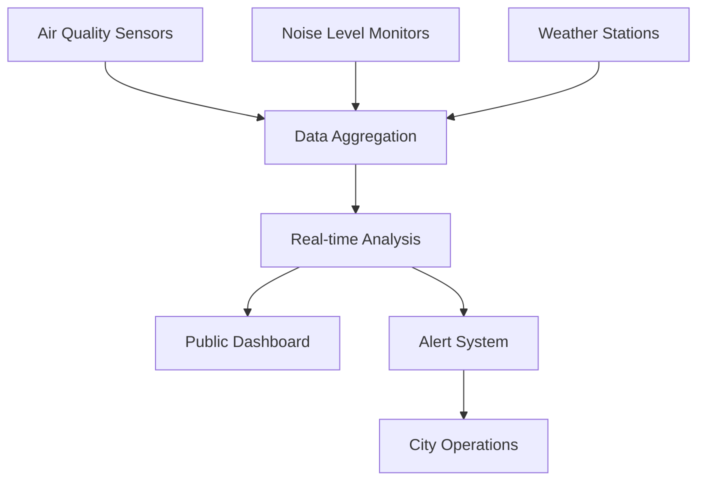

# IoT Platform Schemas

🌐 **Smart city infrastructure monitoring with scalable IoT data management**

This directory contains Avro schemas for a comprehensive IoT platform managing thousands of sensors and devices across smart city infrastructure, demonstrating real-time monitoring, alerting, and device management patterns.

## 📁 Schema Categories

### [Sensor Readings](sensor-readings/)
**Business Context**: Environmental monitoring across smart city infrastructure

- **v1**: Multi-sensor environmental data collection

**Key Features**:
- Multiple sensor types (temperature, humidity, air quality, noise)
- Geospatial location tracking
- Quality assurance and calibration data
- Environmental context awareness
- Real-time and batch processing support

### [Device Status](device-status/)
**Business Context**: Fleet management and device health monitoring

- **v1**: Basic device health and connectivity tracking
- **v2**: Enhanced monitoring with edge computing and performance metrics

**Key Features**:
- Comprehensive device health monitoring
- Multi-network connectivity support (WiFi, Cellular, LoRa, Zigbee)
- Battery and resource usage tracking
- Firmware management
- Error condition monitoring
- Edge computing capabilities

### [Alert Events](alert-events/)
**Business Context**: Real-time threshold monitoring and incident response

- **v1**: Basic threshold violation alerting
- **v2**: ML-enhanced anomaly detection with correlation and automated responses

**Key Features**:
- Threshold-based alerting
- ML-driven anomaly detection
- Alert correlation and root cause analysis
- Automated response recommendations
- Escalation management
- Multi-channel notifications

## 🔄 Evolution Patterns Demonstrated

### Device Fleet Expansion
**Device Status v1 → v2**

```json
// Added in v2 for larger device deployments
{
  "name": "device_group",
  "type": ["null", "string"],
  "default": null,
  "doc": "Device group or cluster identifier"
},
{
  "name": "performance_metrics",
  "type": {
    "type": "record",
    "name": "PerformanceMetrics",
    "fields": [
      {
        "name": "data_processing_rate",
        "type": ["null", "float"],
        "default": null,
        "doc": "Data processing rate (messages/second)"
      },
      {
        "name": "edge_compute_utilization",
        "type": ["null", "int"],
        "default": null,
        "doc": "Edge computing resource utilization percentage"
      }
    ]
  },
  "default": {...}
}
```

### Advanced Analytics Integration
**Alert Events v1 → v2**

```json
// Added in v2 for ML-powered insights
{
  "name": "anomaly_detection",
  "type": {
    "type": "record",
    "name": "AnomalyDetection",
    "fields": [
      {
        "name": "is_anomaly",
        "type": "boolean",
        "default": false
      },
      {
        "name": "anomaly_score",
        "type": ["null", "float"],
        "default": null,
        "doc": "Anomaly score from ML model (0.0-1.0)"
      },
      {
        "name": "model_version",
        "type": ["null", "string"],
        "default": null
      }
    ]
  },
  "default": {...}
}
```

## 🎯 Smart City Use Cases

### Environmental Monitoring Network


**Data Flow**:
1. **Sensor Readings** → Environmental data collection
2. **Device Status** → Health monitoring of sensor network
3. **Alert Events** → Threshold violations and anomalies

### Smart Traffic Management
```yaml
Scenario: Traffic flow optimization
Sensors:
  - Vehicle detection sensors
  - Speed measurement devices
  - Pedestrian crossing monitors
  - Traffic light controllers

Metrics Tracked:
  - Vehicle count and speed
  - Pedestrian traffic patterns
  - Traffic light timing efficiency
  - Air quality impact

Alerts:
  - Traffic congestion detection
  - Pedestrian safety incidents
  - Equipment malfunctions
  - Environmental threshold breaches
```

### Smart Building Management
```yaml
Scenario: Commercial building optimization
Sensors:
  - HVAC temperature/humidity sensors
  - Occupancy detection sensors
  - Energy consumption monitors
  - Security and access sensors

Optimizations:
  - Energy usage reduction
  - Comfort level maintenance
  - Predictive maintenance
  - Security monitoring

Integrations:
  - Building management systems
  - Energy grid optimization
  - Facilities management
  - Emergency response systems
```

## 🔧 Technical Implementation

### Real-time Data Pipeline
```python
# Example IoT data processing pipeline
class IoTPipeline:
    def process_sensor_reading(self, reading):
        # 1. Validate sensor data
        if not self.validate_reading(reading):
            self.log_data_quality_issue(reading)
            return
        
        # 2. Update device status
        self.update_device_last_seen(reading.device_id)
        
        # 3. Check alert thresholds
        alerts = self.check_thresholds(reading)
        for alert in alerts:
            self.publish_alert(alert)
        
        # 4. Store for analytics
        self.store_reading(reading)
        
        # 5. Update real-time dashboard
        self.update_dashboard(reading)

    def check_thresholds(self, reading):
        alerts = []
        for measurement in reading.measurements:
            if self.exceeds_threshold(measurement):
                alert = AlertEvent(
                    device_id=reading.device_id,
                    alert_type='THRESHOLD_VIOLATION',
                    threshold_condition={
                        'metric_name': measurement.type,
                        'actual_value': measurement.value,
                        'threshold_value': self.get_threshold(measurement.type)
                    }
                )
                alerts.append(alert)
        return alerts
```

### Device Management System
```python
# Example device fleet management
class DeviceManager:
    def monitor_device_health(self, status):
        # Analyze device health metrics
        health_score = self.calculate_health_score(status)
        
        # Check for maintenance needs
        if status.health.battery_level < 20:
            self.schedule_battery_replacement(status.device_id)
        
        if status.firmware.update_available:
            self.schedule_firmware_update(status.device_id)
        
        # Monitor connectivity issues
        if status.connectivity.status == 'INTERMITTENT':
            self.diagnose_connectivity_issue(status.device_id)
        
        # Update device registry
        self.update_device_registry(status.device_id, health_score)

    def calculate_health_score(self, status):
        factors = {
            'battery': status.health.battery_level / 100,
            'connectivity': 1.0 if status.connectivity.status == 'ONLINE' else 0.5,
            'error_rate': 1.0 - (len(status.error_conditions) * 0.2),
            'uptime': min(status.health.uptime_seconds / (30 * 24 * 3600), 1.0)
        }
        return sum(factors.values()) / len(factors)
```

### Alert Correlation Engine
```python
# Example alert correlation and analysis
class AlertCorrelationEngine:
    def correlate_alerts(self, new_alert):
        # Find related alerts in time/space
        related_alerts = self.find_related_alerts(
            new_alert.location,
            new_alert.triggered_at,
            time_window_minutes=15,
            radius_meters=1000
        )
        
        if len(related_alerts) > 2:
            # Create correlation group
            correlation_id = self.create_correlation_group(related_alerts)
            
            # Analyze for root cause
            root_cause = self.analyze_root_cause(related_alerts)
            if root_cause:
                self.mark_root_cause_candidate(root_cause.alert_id)
            
            # Update all alerts with correlation info
            for alert in related_alerts:
                self.update_alert_correlation(alert.alert_id, correlation_id)
        
        return new_alert

    def recommend_actions(self, alert):
        recommendations = []
        
        if alert.alert_type == 'DEVICE_OFFLINE':
            recommendations.append({
                'action_type': 'INVESTIGATE',
                'description': 'Check device connectivity and power',
                'urgency': 'WITHIN_HOUR'
            })
        
        elif alert.alert_type == 'THRESHOLD_VIOLATION':
            if alert.threshold_condition.metric_name == 'air_quality':
                recommendations.append({
                    'action_type': 'CONTACT_SUPPORT',
                    'description': 'Alert environmental authorities',
                    'urgency': 'IMMEDIATE'
                })
        
        return recommendations
```

## 📊 Analytics and Insights

### Key Performance Indicators

**Device Fleet Metrics**:
- Device uptime percentage
- Battery life optimization
- Connectivity reliability
- Firmware update compliance
- Error rate trends

**Environmental Metrics**:
- Air quality index trends
- Noise pollution patterns
- Temperature variation analysis
- Humidity correlation studies
- Seasonal pattern recognition

**Alert Metrics**:
- Alert volume and trends
- Response time performance
- False positive rates
- Escalation effectiveness
- Resolution time analysis

### Sample Analytics Queries

```sql
-- Device health summary
SELECT 
    device_type,
    zone,
    COUNT(*) as total_devices,
    AVG(CASE WHEN status = 'ACTIVE' THEN 1 ELSE 0 END) as uptime_rate,
    AVG(battery_level) as avg_battery_level
FROM device_status 
WHERE reported_at >= current_date - interval '24 hours'
GROUP BY device_type, zone;

-- Environmental trend analysis
SELECT 
    DATE(timestamp) as date,
    measurement_type,
    zone,
    AVG(value) as avg_value,
    MAX(value) as max_value,
    COUNT(*) as reading_count
FROM sensor_readings 
WHERE timestamp >= current_date - interval '30 days'
GROUP BY DATE(timestamp), measurement_type, zone
ORDER BY date DESC;

-- Alert analysis
SELECT 
    alert_type,
    severity,
    COUNT(*) as alert_count,
    AVG(EXTRACT(EPOCH FROM (resolved_at - triggered_at))/3600) as avg_resolution_hours
FROM alert_events 
WHERE triggered_at >= current_date - interval '7 days'
  AND status = 'RESOLVED'
GROUP BY alert_type, severity;
```

## 🔒 Security and Compliance

### Device Security

**Authentication**:
- Device certificates and PKI
- Secure device provisioning
- Regular key rotation
- Tamper detection

**Communication Security**:
- End-to-end encryption
- Network segmentation
- VPN tunneling for cellular
- Certificate-based authentication

**Data Privacy**:
- Location data anonymization
- Personal data minimization
- Consent management for public sensors
- Data retention policies

### Compliance Requirements

**Regulatory Frameworks**:
- GDPR for personal data
- Environmental monitoring standards
- Municipal data governance
- Industry safety regulations

**Data Governance**:
```json
{
  "data_classification": "public",
  "retention_period": "7_years", 
  "anonymization_required": false,
  "encryption_at_rest": true,
  "encryption_in_transit": true,
  "access_controls": [
    "city_operations",
    "environmental_authorities",
    "emergency_services"
  ]
}
```

## 🚀 Scaling Strategies

### Horizontal Scaling

**Data Partitioning**:
- By geographic zone
- By device type
- By time period
- By data criticality

**Processing Distribution**:
```yaml
processing_tiers:
  edge:
    - Real-time threshold checking
    - Data filtering and compression
    - Local alerting
    
  regional:
    - Device health monitoring
    - Regional correlation analysis
    - Batch processing
    
  central:
    - ML model training
    - Long-term analytics
    - Reporting and dashboards
```

### Performance Optimization

**Data Compression**:
- Time-series compression
- Delta encoding for similar readings
- Adaptive sampling rates
- Edge-based data aggregation

**Caching Strategy**:
- Recent readings cache
- Device status cache
- Alert rule cache
- Dashboard data cache

## 🔗 Integration Patterns

### External System Integration

**City Management Systems**:
- Traffic control systems
- Emergency response dispatch
- Environmental agencies
- Public transportation

**Third-party Services**:
- Weather data providers
- Air quality databases
- Noise monitoring networks
- Satellite imagery services

**API Integration**:
```python
# Example external API integration
class CitySystemsIntegrator:
    def sync_environmental_data(self, readings):
        # Send to environmental agency
        self.environmental_api.submit_readings(
            readings=readings,
            format='standard_format',
            certification='city_certified'
        )
        
        # Update traffic systems
        if 'air_quality' in readings:
            self.traffic_system.update_emission_data(
                readings['air_quality']
            )
        
        # Alert emergency services if needed
        critical_readings = self.filter_critical_readings(readings)
        if critical_readings:
            self.emergency_dispatch.notify(critical_readings)
```

## 📈 Future Enhancements

### Planned Evolution

**AI/ML Integration**:
- Predictive maintenance models
- Anomaly detection algorithms
- Pattern recognition systems
- Automated response systems

**Edge Computing**:
- Local ML inference
- Distributed processing
- Autonomous device networks
- Real-time decision making

**5G and Advanced Connectivity**:
- Ultra-low latency communications
- Massive device connectivity
- Network slicing for IoT
- Edge cloud integration

## 🔗 Related Resources

- [Schema Evolution Examples](../evolution-examples/)
- [E-commerce Schemas](../ecommerce/) - For customer analytics
- [Fintech Schemas](../fintech/) - For payment processing
- [SaaS Platform Schemas](../saas-platform/) - For user analytics

---

**Next Steps**:
1. Deploy schemas to your IoT platform
2. Implement device management workflows
3. Set up real-time monitoring and alerting
4. Integrate with city management systems
5. Develop ML models for predictive analytics
