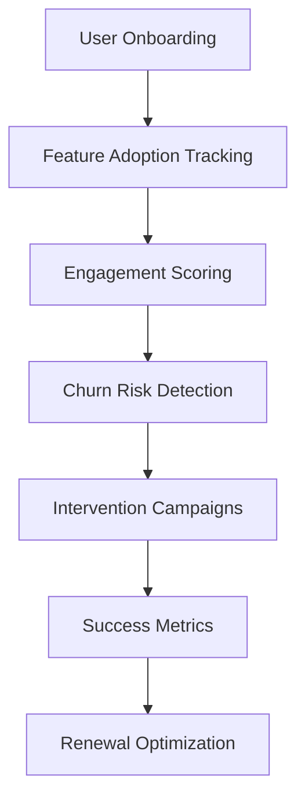

# SaaS Platform Schemas

🚀 **Multi-tenant B2B SaaS platform serving diverse enterprise customers**

This directory contains Avro schemas for a comprehensive B2B SaaS platform, demonstrating multi-tenancy, analytics, user behavior tracking, and customer integration patterns essential for modern SaaS businesses.

## 📁 Schema Categories

### [User Events](user-events/)
**Business Context**: Customer activity tracking across all tenant organizations

- **v1**: Core user activity and engagement tracking

**Key Features**:
- Multi-tenant user activity tracking
- Session management and attribution
- Feature usage analytics
- Custom event properties
- Geographic and device context
- Privacy-compliant data collection

### [Analytics](analytics/)
**Business Context**: Business intelligence and product analytics for SaaS metrics

- **v1**: Basic analytics event structure
- **v2**: Enhanced with attribution, ML features, and advanced segmentation

**Key Features**:
- Comprehensive event tracking
- Marketing attribution (UTM parameters)
- Funnel and cohort analysis
- A/B testing integration
- ML-driven insights and predictions
- Customer lifecycle tracking

### [Webhooks](webhooks/)
**Business Context**: Customer integration endpoints for real-time notifications

- **v1**: Basic webhook payload structure
- **v2**: Enhanced with filtering, delivery tracking, and advanced security

**Key Features**:
- Multi-tenant webhook management
- Event filtering and routing
- Retry logic and delivery tracking
- Security and verification
- Rate limiting and throttling
- Comprehensive delivery analytics

## 🔄 Evolution Patterns Demonstrated

### Advanced Analytics Integration
**Analytics v1 → v2**

```json
// Added in v2 for enhanced attribution
{
  "name": "attribution",
  "type": {
    "type": "record",
    "name": "Attribution",
    "fields": [
      {
        "name": "utm_source",
        "type": ["null", "string"],
        "default": null
      },
      {
        "name": "utm_campaign",
        "type": ["null", "string"],
        "default": null
      },
      {
        "name": "first_touch_channel",
        "type": ["null", "string"],
        "default": null
      },
      {
        "name": "last_touch_channel",
        "type": ["null", "string"],
        "default": null
      }
    ]
  },
  "default": {...}
}
```

### ML-Powered Insights
**Analytics v1 → v2**

```json
// Added in v2 for predictive analytics
{
  "name": "ml_features",
  "type": {
    "type": "record",
    "name": "MLFeatures",
    "fields": [
      {
        "name": "churn_probability",
        "type": ["null", "float"],
        "default": null,
        "doc": "Predicted churn probability (0.0-1.0)"
      },
      {
        "name": "ltv_prediction",
        "type": ["null", "double"],
        "default": null,
        "doc": "Predicted customer lifetime value"
      },
      {
        "name": "propensity_scores",
        "type": {
          "type": "map",
          "values": "float"
        },
        "default": {},
        "doc": "Propensity scores for various actions"
      }
    ]
  },
  "default": {...}
}
```

### Enhanced Webhook Capabilities
**Webhooks v1 → v2**

```json
// Added in v2 for advanced delivery tracking
{
  "name": "delivery_tracking",
  "type": {
    "type": "record",
    "name": "DeliveryTracking",
    "fields": [
      {
        "name": "status",
        "type": {
          "type": "enum",
          "name": "DeliveryStatus",
          "symbols": ["PENDING", "SENDING", "SUCCESS", "FAILED", "RETRYING", "ABANDONED"]
        },
        "default": "PENDING"
      },
      {
        "name": "response_code",
        "type": ["null", "int"],
        "default": null
      },
      {
        "name": "delivery_duration_ms",
        "type": ["null", "long"],
        "default": null
      }
    ]
  },
  "default": {...}
}
```

## 🎯 SaaS Business Use Cases

### Customer Success and Churn Prevention


**Data Flow**:
1. **User Events** → Track feature adoption and engagement
2. **Analytics** → Calculate engagement scores and cohort analysis
3. **Webhooks** → Trigger customer success workflows

### Product-Led Growth Analytics
```yaml
Scenario: Optimizing product-led growth funnel
Metrics:
  - Trial-to-paid conversion rates
  - Time-to-value measurement
  - Feature adoption patterns
  - User activation milestones
  - Expansion revenue tracking

Data Sources:
  - User behavior events
  - Feature usage analytics
  - Subscription changes
  - Support interactions
  - Marketing attribution

Optimization Areas:
  - Onboarding flow improvements
  - Feature discovery enhancement
  - Activation milestone optimization
  - Expansion opportunity identification
```

### Multi-Tenant Customer Integration
```yaml
Scenario: Enterprise customer data integration
Integration Types:
  - Real-time webhooks
  - Bulk data exports
  - API-based sync
  - Embedded analytics

Customer Use Cases:
  - CRM integration (Salesforce, HubSpot)
  - Marketing automation (Marketo, Pardot)
  - Data warehouses (Snowflake, BigQuery)
  - Business intelligence (Tableau, Looker)
  - Custom internal systems

Delivery Requirements:
  - High reliability (99.9% uptime)
  - Low latency (< 5 seconds)
  - Security compliance (SOC2, GDPR)
  - Scalable throughput (1M+ events/day)
```

## 🔧 Technical Implementation

### Multi-Tenant Event Processing
```python
# Example multi-tenant event processing
class SaaSEventProcessor:
    def process_user_event(self, event):
        # 1. Validate tenant permissions
        if not self.validate_tenant_access(event.tenant_id, event.user_id):
            raise UnauthorizedError("Invalid tenant access")
        
        # 2. Apply tenant-specific configuration
        tenant_config = self.get_tenant_config(event.tenant_id)
        event = self.apply_tenant_filters(event, tenant_config)
        
        # 3. Track feature usage
        self.update_feature_usage(
            tenant_id=event.tenant_id,
            user_id=event.user_id,
            feature=event.feature_name,
            usage_type=event.event_type
        )
        
        # 4. Generate analytics event
        analytics_event = self.create_analytics_event(event)
        self.publish_analytics_event(analytics_event)
        
        # 5. Check for webhook triggers
        webhook_events = self.check_webhook_triggers(event)
        for webhook_event in webhook_events:
            self.queue_webhook_delivery(webhook_event)
        
        # 6. Update real-time dashboards
        self.update_tenant_dashboard(event.tenant_id, event)

    def create_analytics_event(self, user_event):
        # Get user context
        user_context = self.get_user_context(user_event.user_id)
        
        # Calculate cohort information
        cohort_info = self.calculate_cohort_info(
            user_event.tenant_id,
            user_event.user_id
        )
        
        # Get ML predictions
        ml_features = self.get_ml_predictions(
            user_event.tenant_id,
            user_event.user_id
        )
        
        return AnalyticsEvent(
            event_id=generate_id(),
            tenant_id=user_event.tenant_id,
            user_id=user_event.user_id,
            event_type=user_event.event_type,
            category=user_event.category,
            action=user_event.action,
            properties=user_event.properties,
            context=user_context,
            cohort_info=cohort_info,
            ml_features=ml_features,
            timestamp=user_event.timestamp
        )
```

### Customer Success Automation
```python
# Example customer success workflow automation
class CustomerSuccessEngine:
    def analyze_user_engagement(self, tenant_id, user_id):
        # Get recent user activity
        recent_events = self.get_user_events(
            tenant_id=tenant_id,
            user_id=user_id,
            days=30
        )
        
        # Calculate engagement metrics
        engagement_score = self.calculate_engagement_score(recent_events)
        feature_adoption = self.calculate_feature_adoption(recent_events)
        time_to_value = self.calculate_time_to_value(user_id)
        
        # Assess churn risk
        churn_indicators = self.assess_churn_risk(
            engagement_score,
            feature_adoption,
            time_to_value
        )
        
        # Trigger interventions if needed
        if churn_indicators.risk_level == 'HIGH':
            self.trigger_churn_prevention_workflow(
                tenant_id=tenant_id,
                user_id=user_id,
                risk_factors=churn_indicators.factors
            )
        
        # Identify expansion opportunities
        expansion_opportunities = self.identify_expansion_opportunities(
            tenant_id=tenant_id,
            user_id=user_id,
            feature_adoption=feature_adoption
        )
        
        if expansion_opportunities:
            self.trigger_expansion_workflow(
                tenant_id=tenant_id,
                opportunities=expansion_opportunities
            )
        
        return {
            'engagement_score': engagement_score,
            'churn_risk': churn_indicators,
            'expansion_opportunities': expansion_opportunities
        }

    def trigger_churn_prevention_workflow(self, tenant_id, user_id, risk_factors):
        # Create webhook for customer success team
        webhook_payload = WebhookPayload(
            webhook_id=generate_id(),
            tenant_id=tenant_id,
            event_type='USER_AT_RISK',
            payload=EventPayload(
                object_type='user',
                object_id=user_id,
                action='churn_risk_detected',
                data={
                    'risk_level': 'HIGH',
                    'risk_factors': risk_factors,
                    'recommended_actions': [
                        'Schedule check-in call',
                        'Provide onboarding assistance',
                        'Share relevant use cases'
                    ]
                }
            )
        )
        
        self.deliver_webhook(webhook_payload)
```

### Webhook Delivery System
```python
# Example webhook delivery system with reliability
class WebhookDeliverySystem:
    def deliver_webhook(self, webhook_payload):
        delivery_tracking = DeliveryTracking(
            status='PENDING',
            response_code=None,
            delivery_duration_ms=None,
            error_message=None
        )
        
        webhook_payload.delivery_tracking = delivery_tracking
        
        try:
            start_time = time.time()
            
            # Apply rate limiting
            if self.is_rate_limited(webhook_payload.tenant_id):
                self.schedule_delayed_delivery(webhook_payload)
                return
            
            # Prepare request
            headers = self.prepare_headers(webhook_payload)
            payload_data = self.serialize_payload(webhook_payload)
            
            # Add security signature
            signature = self.generate_signature(
                payload_data,
                webhook_payload.security.signature_method
            )
            headers['X-Webhook-Signature'] = signature
            
            # Make HTTP request
            delivery_tracking.status = 'SENDING'
            response = requests.post(
                webhook_payload.delivery_info.url,
                data=payload_data,
                headers=headers,
                timeout=webhook_payload.delivery_info.timeout_seconds
            )
            
            # Record delivery metrics
            delivery_duration = (time.time() - start_time) * 1000
            delivery_tracking.delivery_duration_ms = delivery_duration
            delivery_tracking.response_code = response.status_code
            
            if response.status_code == 200:
                delivery_tracking.status = 'SUCCESS'
                self.record_successful_delivery(webhook_payload)
            else:
                delivery_tracking.status = 'FAILED'
                delivery_tracking.error_message = f"HTTP {response.status_code}"
                self.schedule_retry(webhook_payload)
            
        except Exception as e:
            delivery_tracking.status = 'FAILED'
            delivery_tracking.error_message = str(e)
            self.schedule_retry(webhook_payload)
        
        finally:
            delivery_tracking.last_attempt_at = current_timestamp()
            self.update_delivery_tracking(webhook_payload)

    def schedule_retry(self, webhook_payload):
        retry_info = webhook_payload.retry_info
        
        if retry_info.attempt >= retry_info.max_attempts:
            webhook_payload.delivery_tracking.status = 'ABANDONED'
            self.notify_delivery_failure(webhook_payload)
            return
        
        # Calculate next retry time
        retry_delay = self.calculate_retry_delay(
            retry_info.attempt,
            retry_info.retry_strategy,
            retry_info.backoff_multiplier,
            retry_info.jitter_enabled
        )
        
        retry_info.attempt += 1
        retry_info.next_retry_at = current_timestamp() + retry_delay
        webhook_payload.delivery_tracking.status = 'RETRYING'
        
        # Schedule retry
        self.schedule_webhook_delivery(webhook_payload, retry_delay)
```

## 📊 SaaS Metrics and Analytics

### Product Metrics

**Engagement Metrics**:
- Daily/Monthly Active Users (DAU/MAU)
- Feature adoption rates
- Session duration and frequency
- User journey completion rates
- Time-to-value measurement

**Business Metrics**:
- Customer Acquisition Cost (CAC)
- Customer Lifetime Value (LTV)
- Monthly Recurring Revenue (MRR)
- Churn rate and retention
- Net Revenue Retention (NRR)

**Product-Led Growth Metrics**:
- Trial-to-paid conversion
- Product-qualified leads (PQLs)
- Expansion revenue
- Feature usage correlation with retention
- Onboarding completion rates

### Sample Analytics Queries

```sql
-- Feature adoption by tenant size
SELECT 
    t.plan_tier,
    u.feature_name,
    COUNT(DISTINCT u.tenant_id) as adopting_tenants,
    COUNT(DISTINCT u.user_id) as adopting_users,
    AVG(u.usage_count) as avg_usage_per_user
FROM user_events u
JOIN tenants t ON u.tenant_id = t.id
WHERE u.timestamp >= current_date - interval '30 days'
  AND u.event_type = 'FEATURE_USED'
GROUP BY t.plan_tier, u.feature_name;

-- Cohort retention analysis
SELECT 
    signup_cohort,
    period_number,
    COUNT(DISTINCT user_id) as active_users,
    COUNT(DISTINCT user_id) / FIRST_VALUE(COUNT(DISTINCT user_id)) 
        OVER (PARTITION BY signup_cohort ORDER BY period_number) as retention_rate
FROM (
    SELECT 
        a.signup_cohort,
        a.user_id,
        DATEDIFF('month', DATE(a.signup_cohort), DATE(a.timestamp)) as period_number
    FROM analytics_events a
    WHERE a.event_type = 'USER_ACTIVE'
) cohort_activity
GROUP BY signup_cohort, period_number
ORDER BY signup_cohort, period_number;

-- Webhook delivery performance
SELECT 
    w.tenant_id,
    w.event_type,
    COUNT(*) as total_deliveries,
    AVG(w.delivery_tracking.delivery_duration_ms) as avg_delivery_time,
    SUM(CASE WHEN w.delivery_tracking.status = 'SUCCESS' THEN 1 ELSE 0 END) / COUNT(*) as success_rate
FROM webhook_payloads w
WHERE w.created_at >= current_date - interval '7 days'
GROUP BY w.tenant_id, w.event_type;

-- Churn prediction accuracy
SELECT 
    DATE(a.timestamp) as prediction_date,
    CASE 
        WHEN a.ml_features.churn_probability > 0.7 THEN 'HIGH_RISK'
        WHEN a.ml_features.churn_probability > 0.3 THEN 'MEDIUM_RISK'
        ELSE 'LOW_RISK'
    END as predicted_risk,
    COUNT(*) as predictions,
    SUM(CASE WHEN actual_churn_within_30_days THEN 1 ELSE 0 END) as actual_churns,
    SUM(CASE WHEN actual_churn_within_30_days THEN 1 ELSE 0 END) / COUNT(*) as precision
FROM analytics_events a
LEFT JOIN churn_outcomes c ON a.user_id = c.user_id 
    AND c.evaluation_date = DATE(a.timestamp) + interval '30 days'
WHERE a.timestamp >= current_date - interval '90 days'
  AND a.ml_features.churn_probability IS NOT NULL
GROUP BY DATE(a.timestamp), predicted_risk;
```

## 🔒 Multi-Tenant Security and Privacy

### Data Isolation

**Tenant Segregation**:
- Physical data separation by tenant
- Row-level security policies
- Encrypted tenant-specific keys
- API access controls

**Privacy Controls**:
```json
{
  "data_processing_consent": {
    "analytics_tracking": true,
    "behavioral_analysis": false,
    "marketing_attribution": true,
    "ml_predictions": false
  },
  "data_retention": {
    "user_events": "2_years",
    "analytics_data": "7_years",
    "webhook_logs": "90_days",
    "ml_features": "1_year"
  },
  "anonymization": {
    "after_account_deletion": true,
    "for_analytics_research": true,
    "cross_tenant_analysis": true
  }
}
```

### Compliance Framework

**Standards Compliance**:
- SOC 2 Type II certification
- GDPR compliance for EU customers
- CCPA compliance for California users
- HIPAA compliance for healthcare tenants
- ISO 27001 security standards

**Audit and Monitoring**:
- Real-time security monitoring
- Compliance audit trails
- Data access logging
- Incident response procedures
- Regular security assessments

## 🚀 Scaling and Performance

### High-Volume Data Processing

**Event Processing Architecture**:
```yaml
processing_tiers:
  ingestion:
    - Multi-region event collection
    - Load balancing and buffering
    - Schema validation
    - Duplicate detection
    
  stream_processing:
    - Real-time analytics computation
    - Feature usage tracking
    - Webhook trigger evaluation
    - Anomaly detection
    
  batch_processing:
    - ML model training
    - Cohort analysis
    - Retention calculations
    - Data warehouse sync
```

**Performance Optimization**:
- Event batching and compression
- Intelligent data partitioning
- Predictive caching strategies
- Asynchronous processing pipelines

### Auto-Scaling Strategies

**Dynamic Scaling**:
```python
# Example auto-scaling configuration
scaling_policies = {
    'webhook_delivery': {
        'scale_up_threshold': 'queue_depth > 1000',
        'scale_down_threshold': 'queue_depth < 100',
        'min_instances': 2,
        'max_instances': 50
    },
    'analytics_processing': {
        'scale_up_threshold': 'cpu_utilization > 70%',
        'scale_down_threshold': 'cpu_utilization < 30%',
        'min_instances': 5,
        'max_instances': 100
    },
    'ml_inference': {
        'scale_up_threshold': 'prediction_latency > 500ms',
        'scale_down_threshold': 'prediction_latency < 100ms',
        'min_instances': 3,
        'max_instances': 20
    }
}
```

## 🔗 Customer Integration Ecosystem

### Popular Integrations

**CRM Systems**:
- Salesforce (leads, opportunities, accounts)
- HubSpot (contacts, deals, companies)
- Pipedrive (activities, deals)
- Microsoft Dynamics (customer data)

**Marketing Automation**:
- Marketo (lead scoring, campaigns)
- Pardot (prospect tracking)
- Mailchimp (email campaigns)
- Segment (customer data platform)

**Data Platforms**:
- Snowflake (data warehouse)
- BigQuery (analytics)
- Databricks (ML and analytics)
- Amazon Redshift (data warehouse)

### Integration Examples

```python
# Example Salesforce integration
class SalesforceIntegration:
    def sync_user_activity(self, analytics_event):
        if analytics_event.event_type == 'FEATURE_USED':
            # Update Salesforce lead score
            self.salesforce_api.update_lead(
                email=analytics_event.user_email,
                custom_fields={
                    'Product_Engagement_Score__c': analytics_event.engagement_score,
                    'Last_Feature_Used__c': analytics_event.feature_name,
                    'Feature_Adoption_Count__c': analytics_event.total_feature_usage
                }
            )
        
        elif analytics_event.ml_features.churn_probability > 0.7:
            # Create Salesforce task for customer success
            self.salesforce_api.create_task(
                subject='High Churn Risk - Immediate Action Required',
                description=f'User {analytics_event.user_id} has {analytics_event.ml_features.churn_probability:.1%} churn probability',
                assigned_to='customer_success_team',
                priority='High',
                due_date=date.today() + timedelta(days=1)
            )

# Example data warehouse sync
class DataWarehouseSync:
    def sync_analytics_data(self, batch_events):
        # Transform events for warehouse schema
        warehouse_records = []
        for event in batch_events:
            record = {
                'event_id': event.event_id,
                'tenant_id': event.tenant_id,
                'user_id': event.user_id,
                'event_timestamp': event.timestamp,
                'event_type': event.event_type,
                'feature_name': event.properties.get('feature_name'),
                'session_duration': event.metrics.duration_ms,
                'device_type': event.context.device_type,
                'utm_source': event.attribution.utm_source,
                'churn_probability': event.ml_features.churn_probability,
                'ltv_prediction': event.ml_features.ltv_prediction
            }
            warehouse_records.append(record)
        
        # Bulk insert to data warehouse
        self.warehouse_client.bulk_insert(
            table='saas_analytics_events',
            records=warehouse_records,
            partition_column='event_timestamp'
        )
```

## 🔗 Related Resources

- [Schema Evolution Examples](../evolution-examples/)
- [E-commerce Schemas](../ecommerce/) - For customer journey tracking
- [Fintech Schemas](../fintech/) - For payment analytics
- [IoT Platform Schemas](../iot-platform/) - For device analytics

---

**Next Steps**:
1. Deploy schemas to your SaaS analytics platform
2. Implement multi-tenant event processing
3. Set up customer success automation
4. Configure webhook delivery system
5. Integrate with customer data platforms
6. Build predictive analytics models
